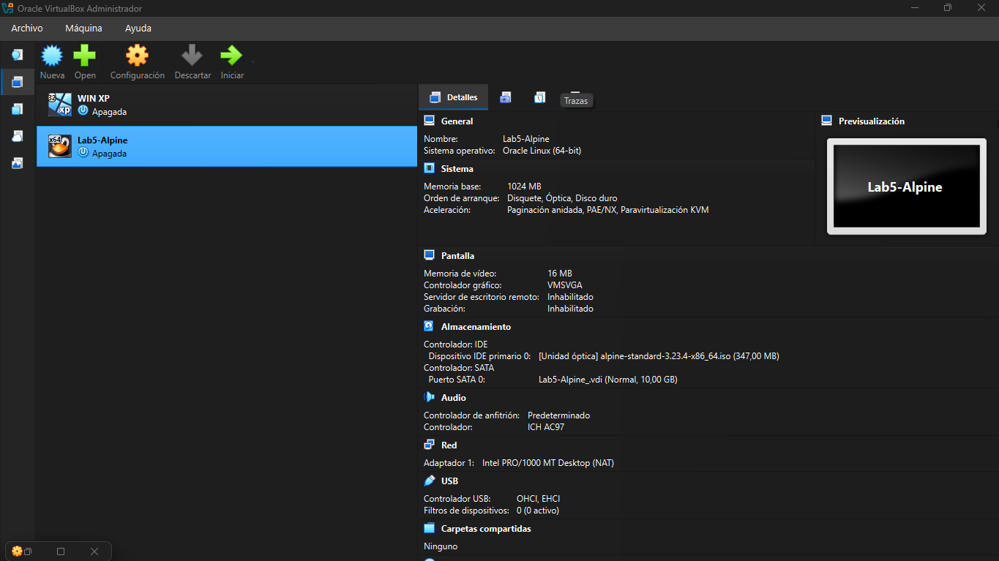

# Laboratorio Unidad 5 - VirtualBox (Máquinas Virtuales)

## Datos del estudiante
- Nombre: Yulian Andres Ortega Machado
- Curso: Arquitectura de Computadores
- Fecha: 02/05/26

---

## Descripción del laboratorio
En este laboratorio se creó y configuró una máquina virtual Linux utilizando VirtualBox, se probaron distintos modos de red, se gestionaron snapshots y se exportó la máquina en formato OVF.

---

## Configuración de la máquina virtual
- Nombre: Lab5-Alpine
- Sistema operativo: Alpine Linux 3.19
- RAM: 1024 MB
- CPU: 1
- Disco: 10 GB (VDI, dinámico)

---

## Estructura del repositorio
- capturas/ → evidencias de cada checkpoint
- VBoxManage_commands.sh → comandos utilizados
- README.md → documentación

---

# Desarrollo del laboratorio

## 1: Creación de la VM

Se creó la máquina virtual con los parámetros solicitados y se adjuntó la ISO de Alpine Linux.

## 2: Instalación de Alpine Linux

Se realizó la instalación del sistema operativo Alpine Linux dentro de la máquina virtual creada previamente.

El proceso se llevó a cabo utilizando el comando `setup-alpine`, donde se configuraron los siguientes aspectos:

- Distribución de teclado: es
- Hostname: lab5-alpine
- Red: configuración automática mediante DHCP
- Zona horaria: America/Bogota
- Cliente NTP: chrony
- Usuario: no se creó usuario adicional (se utilizó root)
- Servidor SSH: openssh
- Disco: sda
- Tipo de instalación: sys (instalación en disco)

Posteriormente, se completó la instalación en el disco virtual y se reinició la máquina, retirando la imagen ISO para permitir el arranque desde el disco.

Se verificó que el sistema inicia correctamente mostrando la pantalla de login.

## 3: Modos de red

Se configuraron y probaron distintos modos de red en la máquina virtual.

| Modo      | IP obtenida    | Internet |
|-----------|--------------  |----------|
| NAT       | 10.0.2.15      | Sí       |
| Host-Only | 192.168.56.101 | No       |

### NAT

### Host-Only

